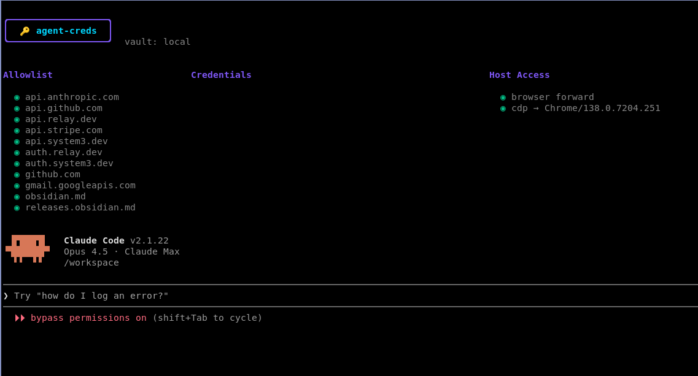

# agent-creds

Agent sandbox with integrated credential injection proxy. Allows unmodified code to hit e.g. `https://api.stripe.com` and have API credentials injected transparently via an Envoy proxy with TLS termination.




**Status: Experimental** — The API and architecture may change significantly. Not recommended for production use.

## Threat Model

This project addresses two security concerns when running AI agents with API access:

### Primary: Credential Leakage to LLM Providers

When an AI agent makes API calls, the credentials are visible to the LLM provider in the conversation context. Even if the agent runs locally, tool outputs containing `Authorization: Bearer sk_live_...` headers get sent back to the model. This proxy keeps real credentials out of the agent's context entirely — the agent only sees an opaque macaroon token, while real API keys are injected server-side.

### Secondary: Limiting Agent Blast Radius

A misbehaving or compromised agent with full API access can do significant damage. Macaroon tokens with caveats provide fine-grained restrictions:

- **Host restrictions**: Token only works for specific APIs (e.g., `api.stripe.com` but not `api.openai.com`)
- **Method restrictions**: Limit to read-only operations (`GET` only)
- **Path restrictions**: Scope access to specific resources (`/v1/customers/*` but not `/v1/transfers/*`)
- **Time restrictions**: Tokens expire automatically (default: 24 hours)

This turns "full API access" into precisely scoped capabilities that match the agent's intended task.

## Architecture

```
┌─────────────────────────────────────────────────────────────┐
│                    Docker network                           │
│                                                             │
│  ┌─────────────┐      ┌─────────────┐      ┌─────────────┐ │
│  │   sandbox   │      │    envoy    │      │    vault    │ │
│  │  (your app) │─────▶│  (TLS term) │─────▶│  (tokens)   │ │
│  └─────────────┘      └─────────────┘      └─────────────┘ │
│   iptables NAT:           │                                 │
│   :443 → envoy            │                                 │
│                           ▼                                 │
└───────────────────────────┼─────────────────────────────────┘
                            │ HTTPS
                            ▼
                    api.stripe.com (real)
```

- **sandbox**: Container running your code, with iptables redirecting all :443 traffic to envoy
- **envoy**: Terminates TLS with runtime-generated certs, calls vault for token validation
- **vault**: Validates macaroon tokens, injects real API keys into requests

## Quick Start

### Prerequisites

- Docker and Docker Compose
- Go 1.21+ (for building tools)

### Setup

```bash
# Create project config
cat > agent-creds.toml << 'EOF'
[sandbox]
name = "myproject"

[upstream."api.stripe.com"]
EOF

# Set environment variables for vault
export MACAROON_SIGNING_KEY=$(openssl rand -base64 32)
export STRIPE_API_KEY=sk_live_xxx

# Start vault service (once)
make up

# Launch sandbox
adev console
```

### adev

`adev` is the main development tool. It launches sandboxed environments where your code runs with transparent API proxying.

```bash
adev              # Show running instances (interactive TUI)
adev console      # Start or attach to sandbox for current directory
adev console foo  # Start or attach to sandbox named "foo"
adev stop         # Stop sandbox for current directory
adev stop foo     # Stop sandbox named "foo"
```

**What adev does:**

- Mounts your current directory at `/workspace` inside the container
- **Blocks all network traffic by default** — the sandbox has no internet access except through the proxy
- Routes only the domains listed in `agent-creds.toml` through envoy
- Starts vault service if not running
- Attaches to existing instances instead of creating duplicates

Multiple named sandboxes can run concurrently.

### Browser Forwarding

Code inside the sandbox can open URLs in your host's default browser:

```bash
xdg-open https://accounts.google.com/oauth/authorize?...
```

This enables OAuth flows where:
1. Sandbox code calls `xdg-open` with auth URL → browser opens on host
2. User authenticates in host browser
3. OAuth callback to `localhost:PORT` routes back into the sandbox

The callback routing works automatically—adev detects localhost URLs with ports and proxies incoming connections from the host back to the sandbox.

Configure in `agent-creds.toml`:
```toml
[sandbox]
use_host_browser = true  # default

# URL allow-list (required - empty = all blocked)
[[browser_target]]
url = "*accounts.google.com/o/oauth*"

[[browser_target]]
url = "http://localhost:*"
```

Only URLs matching a `[[browser_target]]` pattern will be opened. All others return 403.

### Chrome DevTools Protocol (CDP)

Control your host's Chrome browser from inside the sandbox. Playwright, Puppeteer, and other automation tools connect to `localhost:9222` which forwards to Chrome on your host.

```python
# Inside sandbox - controls host Chrome
from playwright.sync_api import sync_playwright
with sync_playwright() as p:
    browser = p.chromium.connect_over_cdp("http://localhost:9222")
    page = browser.new_page()
    page.goto("https://example.com")
```

Start Chrome on your host with remote debugging enabled:
```bash
google-chrome --remote-debugging-port=9222
```

The `aenv` dashboard shows CDP connection status (e.g., "cdp → Chrome 127.0.1").

Configure in `agent-creds.toml`:
```toml
[sandbox]
use_host_browser_cdp = true  # default

# Target allow-list (required - empty = all blocked)
[[cdp_target]]
type = "page"
title = "*My App*"

[[cdp_target]]
url = "*github.com*"
```

Only browser tabs matching a `[[cdp_target]]` pattern will be accessible. This prevents agents from accessing sensitive tabs (email, banking, etc.).

**CDP target fields** (all optional, empty = match any):
- `type`: Target type (`page`, `background_page`, `service_worker`, etc.)
- `title`: Glob pattern matching page title
- `url`: Glob pattern matching page URL

When multiple fields are specified, all must match.

### Network Isolation

Inside the sandbox, only configured domains are reachable:

```bash
# Works - domain is in agent-creds.toml
curl https://api.stripe.com/v1/customers \
  -H "Authorization: Bearer $STRIPE_TOKEN"

# Blocked - domain not configured
curl https://example.com  # connection refused
```

### Credential Swap

The core feature: your code uses an opaque macaroon token, and the proxy swaps it for the real API key before forwarding to the upstream.

```bash
# 1. Mint a token (on host, before launching sandbox)
export STRIPE_TOKEN=$(bin/mint --hosts api.stripe.com --valid-for 1h)

# 2. Launch sandbox with token as env var
STRIPE_TOKEN=$STRIPE_TOKEN adev console

# 3. Inside sandbox, use the token normally
curl https://api.stripe.com/v1/customers \
  -H "Authorization: Bearer $STRIPE_TOKEN"
```

The sandbox never sees `sk_live_...` — only the macaroon token. The vault service validates the token and injects the real Stripe API key before the request reaches Stripe.

### Minting Tokens

Tokens can include caveats that restrict what the token can do:

```bash
# Full access to configured APIs
bin/mint

# Read-only access to Stripe customers endpoint for 1 hour
bin/mint --hosts api.stripe.com --methods GET --paths "/v1/customers/*" --valid-for 1h
```

#### Token Options

| Flag | Description | Example |
|------|-------------|---------|
| `--hosts` | Allowed API hosts | `api.stripe.com,api.openai.com` |
| `--methods` | Allowed HTTP methods | `GET,POST` |
| `--paths` | Allowed path patterns (`*` = segment, `**` = multiple) | `/v1/customers/*` |
| `--valid-for` | Token expiration | `1h`, `24h`, `7d` |
| `--not-before` | Validity start time (RFC3339) | `2024-01-01T00:00:00Z` |
| `--show-caveats` | Print caveats to stderr | |

Tokens without restrictions (no `--hosts`, `--methods`, `--paths`) have full access to all configured APIs.

## Configuration

### agent-creds.toml (per-project)

Controls which domains are routed through the proxy:

```toml
[sandbox]
name = "myproject"

[upstream."api.stripe.com"]
[upstream."pocketbase.example.com"]
```

### vault.toml (vault service)

Configures credential injection for each domain:

```toml
[credentials."api.stripe.com"]
type = "bearer"
token = { provider = "env", name = "STRIPE_API_KEY" }

[credentials."pocketbase.example.com"]
type = "basic"
username = { provider = "env", name = "PB_USERNAME" }
password = { provider = "env", name = "PB_PASSWORD" }
```

**Credential types:**
- **bearer**: Injects `Authorization: Bearer <token>`
- **basic**: Injects `Authorization: Basic <base64>` (base64-encoded username:password)

**Providers:**
- **env**: Read from environment variable

### Environment Variables

- `MACAROON_SIGNING_KEY`: Base64-encoded 32+ byte key for signing/verifying tokens
- Plus any env vars referenced in `vault.toml`

## Development Commands

```bash
# Primary workflow
adev              # Interactive TUI showing running sandboxes
adev console      # Start or attach to sandbox

# Vault service
make up           # Start vault with docker-compose
make down         # Stop vault

# Building
make build        # Build sandbox Docker image
make binaries     # Build all CLI tools to bin/

# Maintenance
make deploy       # Deploy vault service to Fly.io
make clean-certs  # Remove generated certs (forces regeneration)
```

## Files

```
.
├── agent-creds.toml      # Project config (per-project)
├── docker-compose.yml    # Vault service config
├── Makefile              # Build/deploy commands
├── envoy-entrypoint.sh   # Runtime cert generation for envoy
├── cmd/
│   ├── adev/             # Development orchestrator
│   ├── actl/             # Control utility for managing instances
│   ├── aenv/             # Environment variable helper
│   └── cdp-proxy/        # Chrome DevTools Protocol proxy
├── generated/            # Generated files (gitignored)
│   ├── certs/            # CA certificate (domain certs generated at runtime)
│   ├── envoy.json        # Envoy config
│   └── domains.json      # Domain config for runtime cert generation
├── vault/
│   ├── main.go           # gRPC vault service
│   ├── macaroon/         # Macaroon token library
│   ├── cmd/mint/         # Token minting CLI
│   └── Dockerfile
└── bin/                  # Built binaries (run make binaries)
```

## How It Works

1. **CA Generation**: `adev` creates a CA cert once in `generated/certs/`
2. **Runtime Certs**: `envoy-entrypoint.sh` generates domain certs at startup using the CA
3. **Traffic Interception**: iptables NAT rules redirect all :443 traffic to envoy
4. **TLS Termination**: Envoy terminates TLS using SNI to select the right certificate, so `https://api.stripe.com` works with unmodified code
5. **Token Verification**: Vault verifies the macaroon token signature and checks caveats (host, method, path, validity)
6. **Credential Injection**: On successful verification, vault injects the real API key before forwarding to upstream
