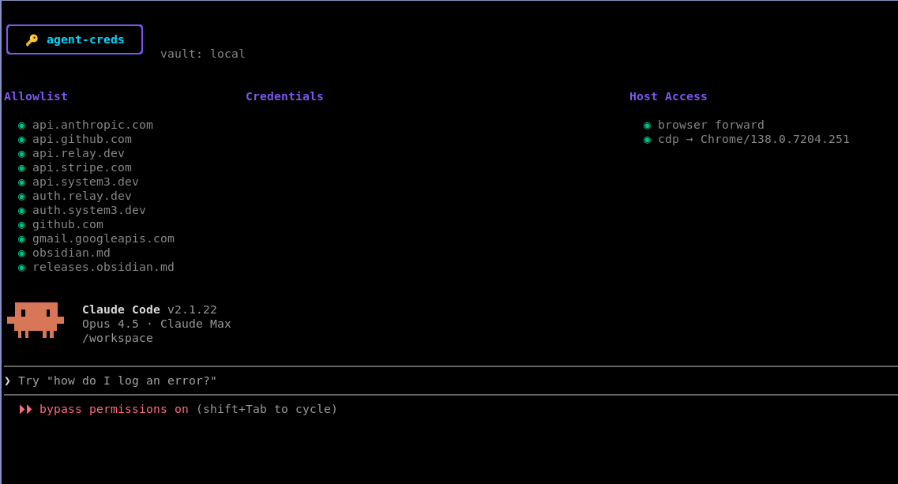

# agent-creds

**Give autonomous coding agents real API access without giving them real API keys.**

`agent-creds` runs Claude Code, Codex, Pi, or another command inside a
deny-by-default network sandbox. The agent calls ordinary HTTPS APIs with a
short-lived capability token. A per-agent Envoy and a shared Vault authorize
the request, replace that token with the real credential, and forward it.

Your existing CLIs and SDKs keep working. The secret never enters the agent's
environment, terminal output, tool results, or model context.

[Quickstart](#quickstart) · [Examples](#examples-and-guides) · [Guide](#guide) ·
[JavaScript extensions](#javascript-extensions) ·
[Security model](#security-model)



## Why agent-creds

Coding agents are most useful when they can operate real systems: inspect
production data, update source control, send messages, or call an internal
API. Putting the corresponding API keys in an agent's environment creates an
uncomfortable failure mode: anything the process can read can eventually
reach a prompt, tool log, dependency, or compromised subprocess.

`agent-creds` separates access from possession:

- **Credentials stay outside the sandbox.** The agent receives a macaroon
  capability such as `acm_...`, never the upstream secret.
- **Egress is allowlisted.** A sandbox can reach only the hosts declared for
  that project, and only through its Envoy.
- **Access can be narrower than the credential.** Host, method, path, time,
  and application-specific caveats constrain each token.
- **Applications remain unmodified.** Environment variables, HTTP clients,
  CLIs, and SDKs send their usual authentication headers.
- **Deployment logic stays private.** Trusted JavaScript extensions can
  exchange credentials, mint sessions, and enforce application policy without
  adding company-specific code to the public binary.
- **Many agents share one credential plane.** Vault is a singleton; each
  sandbox gets its own Envoy and network boundary.

## How it works

```text
  PER AGENT

  bwrap / gVisor / runc
+----------------------+
| Codex, Claude, Pi    |
| CLIs, SDKs, git      |
| TOKEN=acm_...        |
+----------+-----------+
           |
           | configured hosts only
           v                                   SHARED DEPLOYMENT
+----------------------+                       +----------------------+
| Envoy                | --------------------> | Vault                |
| one per sandbox      | <-------------------- | one per deployment   |
+----------+-----------+   approved headers    | secrets + JS policy  |
           |                                   +----------------------+
           | real upstream credential
           v
+----------------------+
| Configured API       |
+----------------------+
```

For a credentialed request:

1. `adev` creates the sandbox, its network namespace, and a scoped macaroon.
2. The sandbox can resolve and connect only to configured upstreams.
3. Envoy terminates the sandbox's TLS connection and asks Vault to authorize
   the request.
4. Vault verifies the macaroon signature and every applicable caveat and
   policy.
5. A built-in or JavaScript credential provider returns the real upstream
   headers.
6. Envoy forwards the request. The agent sees the response, but never the
   credential used to obtain it.

The proxy handles the credential boundary; it is not a general secrets manager
inside the sandbox.

## Quickstart

This walkthrough launches Codex in a `bwrap` sandbox and gives one project
narrow access to an API. Substitute your API's hostname, path, and bearer
token. At the end, the configured request succeeds, an unconfigured request
fails, and the raw token has never entered the sandbox.

### Prerequisites

The `bwrap` runtime currently targets Linux and requires:

- Go 1.24 or later
- Docker with the Compose plugin
- [SOPS](https://github.com/getsops/sops)
- `bwrap`, `slirp4netns`, `unshare`, and `setpriv`
- [zmx](https://github.com/neurosnap/zmx) and a systemd user session
- The agent CLI you intend to run, such as `codex`, on the host `PATH`

The container runtimes are also available: use `runtime = "gvisor"` with
[gVisor](https://gvisor.dev/docs/user_guide/install/) or
`runtime = "runc"` with Docker's default runtime.

### 1. Build the host tools

```console
$ git clone https://github.com/dtkav/agent-creds.git
$ cd agent-creds
$ make binaries
$ export PATH="$PWD/bin:$PATH"
```

The executables remain tied to this checkout: `adev` uses the files beside
its `bin/` directory to build sandboxes and start the credential plane.

### 2. Initialize Vault

```console
$ actl vault init
Age key stored in keychain ...
Vault config: ~/.config/agent-creds/vault.yaml
```

Initialization creates independent macaroon signing and encryption keys,
stores the age identity in your system keychain, and writes a SOPS-encrypted
Vault configuration. Running it again is safe: an existing configuration is
left in place.

Add the API token you want the agent to use:

```console
$ actl vault edit
```

Start and manage the local credential plane through `actl`; it decrypts the
configuration into Compose's environment-backed secret and waits for Vault to
be healthy:

```console
$ actl vault start
$ actl vault restart       # rebuild/recreate after code changes
$ actl vault stop
$ actl vault reload        # apply credential-only edits without a restart
```

The read-only operational dashboard is available at
`http://localhost:8033/`. Authenticate with an enrolled passkey to inspect the
credential collection, non-secret `$secret` pointers, policies, recent
capability mints, and authorization activity. Resolved credentials and minted
capability values are never returned to the dashboard. New passkeys use
discoverable credentials, so the username is optional at sign in; enter it only
for an older security key or when enrolling another passkey. User verification
defaults to `preferred`, which permits touch-only security keys. Set
`WEBAUTHN_USER_VERIFICATION=required` before `actl vault start` to require an
authenticator PIN or biometric instead.

Do not invoke `docker compose up vault` directly: without the decrypted secret
supplied by `actl`, Vault cannot load its signing keys or credentials.

Add a secret group below the generated `vault` group:

```yaml
# Add below `secrets.vault`; leave the generated keys unchanged.
  service:
    API_TOKEN: replace-with-your-api-token
```

Then replace the initial `credentials: {}` with:

```yaml
credentials:
  service/dev:
    type: bearer
    token:
      $secret: service#API_TOKEN
    env: SERVICE_API_TOKEN
```

> [!IMPORTANT]
> Put raw credentials only below `secrets`. SOPS encrypts that subtree.
> Project configuration and credential definitions should contain
> `$secret` references, never copied API keys.

### 3. Configure a project

From the project the agent will work on, create `sandbox.toml`:

```toml
[sandbox]
name = "api-demo"
runtime = "bwrap"
agent = "codex"

[upstream."api.example.com"]
credential = "/service/dev"
methods = ["GET"]
paths = ["/v1/me"]
```

The project file contains policy, not secrets, so it can be reviewed and
committed with the rest of the project.

### 4. Start the agent

```console
$ adev console
```

On first start, `adev` builds and launches the shared Vault, a per-project
Envoy, and the sandbox. Vault also creates a unique SSH host key in its
persistent Docker volume if one is missing.

Ask the agent to run:

```console
$ curl -sS https://api.example.com/v1/me \
    -H "Authorization: Bearer $SERVICE_API_TOKEN"
<response from your API>

$ curl -sS https://example.com
curl: (6) Could not resolve host: example.com
```

Inside the sandbox, `SERVICE_API_TOKEN` starts with `acm_`. Your API receives
the real token only after Vault approves the request.

## Examples and guides

- [Protect a Slack bot token](docs/guides/slack.md) with the built-in bearer
  provider and verify it with `auth.test`.
- [Protect a Stripe API key](docs/guides/stripe.md) with HTTP Basic
  authentication and a path-scoped test-mode credential.
- [Load trusted JavaScript extensions](examples/README.md), including a
  command-backed session provider and a constraint policy.

## Guide

### Run an agent

Bundled profiles configure the agent command, its development tools, and the
network endpoints needed for login and API traffic:

```toml
[sandbox]
runtime = "bwrap"
agent = "claude"  # "codex" or "pi" also work
```

The profiles deliberately disable the agent's own approval prompts. The outer
sandbox and credential plane are the security boundary.

Common commands:

```console
$ adev                 # List all instances
$ adev console         # Start or attach to this project's agent
$ adev console review  # Use a named instance
$ adev start           # Start a bwrap instance in the background
$ adev stop            # Stop this project's instance
$ adev setup           # Configure credential access interactively
$ adev tap status      # Inspect the global metrics collector
```

A `bwrap` agent runs in a zmx-hosted session, so it can detach and resume
without losing the process. Multiple agents can run concurrently; they share
Vault but not Envoy, tokens, generated configuration, or network namespaces.

### Install registered Agent Skills

Skills are named capabilities backed by repositories, independent of a model
provider. Register each skill in a TOML file whose filename matches its name:

```toml
# skills/service-observability.toml
name = "service-observability"
description = "Query an observability service"
repo = "https://github.com/example/capabilities.git"
ref = "main" # a branch, tag, or full revision
path = "skills/service-observability"

# Optional: packages required by the skill. Like plugin `nix`, this expression
# evaluates to a list of derivations with `pkgs` in scope.
nix = "[ pkgs.jq ]"
```

`repo` is a literal Git URL. `ref` is an ordinary Git branch, tag, or full
revision. `path` defaults to the repository root, and `nix` is optional. A
full commit revision is an exact source pin; a branch or tag is resolved by
Git when the environment is built. The declared `ref` is part of the sandbox
environment cache key, so changing it selects and builds a new environment.
There is no adev-specific version, lock, or repository protocol.

Registrations use the same precedence model as plugins: bundled
`<agent-creds>/skills/`, global `~/.config/agent-creds/skills/`, then the
project's `skills/`. A later registration with the same filename overrides an
earlier one. Registration does not enable a skill. Refer to it by name from
the sandbox:

```toml
[sandbox]
agent = "codex"
skills = ["service-observability"]
```

Plugin and agent profiles may also declare `skills = [...]` as dependencies.
The selected agent profile supplies the harness's native `skill_dir`. Nix
first fetches the registered repositories into a provider-neutral skills
output; the final harness layer copies the selected skills from there into
that native layout.
At launch, `adev` mounts each installed skill read-only over the harness's
persistent state, so Claude, Codex, and Pi consume the same sovereign source
repositories without symlinks. Registered skills currently require the local
Nix-backed sandbox image (`image = "sandbox-local"`, the default).

### Collect GenAI operation metrics

Enable the system-wide collector once:

```console
$ adev tap enable                  # UI defaults to 127.0.0.1:52000
$ adev tap enable --ui-port 52812  # choose another loopback port
$ adev tap status
```

On the next instance start, its Envoy automatically registers its private admin
socket with the singleton. No project configuration is required. Envoy copies
provider exchanges before credential injection. The collector recognizes
OpenAI Responses and Anthropic Messages traffic, builds normalized operations
in bounded memory, then discards the transport data. Its SQLite schema stores
only source, provider, operation, model, timing, outcome, byte counts, and
provider-reported token counts. It has no fields for headers, URLs,
request/response bodies, prompts, or generic JSON.

All instances feed one database at `generated/tap/data/operations.db`. The
loopback service provides the live UI at `/`, normalized JSON at
`/api/operations`, an SSE feed at
`/api/operations/stream`, Prometheus metrics at `/metrics`, and normalized
OpenTelemetry GenAI JSONL at `/api/export/otel-genai.jsonl`.

The collector is out of the request path: `adev tap disable` stops it without
interrupting agent traffic or deleting the database. It uses a dedicated,
non-masqueraded Docker network only for its loopback-published UI and receives
a read-only tree of Envoy admin sockets—no Vault configuration, macaroons,
provider credentials, routed internet egress, or instance network attachment.
The global switch is stored in `~/.config/agent-creds/tap.toml`. Because the
Envoy tap filter is part of bootstrap configuration, restart an instance after
changing the global switch.

### Declare network and credential access

Every reachable upstream must appear in `sandbox.toml`:

```toml
[sandbox]
name = "service-review"
runtime = "bwrap"
agent = "codex"

[upstream."api.example.com"]
credential = "/service/read"
methods = ["GET"]
paths = ["/v1/customers/**", "/v1/subscriptions/**"]

[upstream."api.github.com"]
# No credential: existing caller authentication passes through unchanged.
methods = ["GET"]
paths = ["/repos/example/**"]
```

The main upstream fields are:

| Field | Meaning |
| --- | --- |
| `credential` | Select the Vault credential for the route, such as `/service/read`; does not by itself deliver a capability into the sandbox |
| `env` | Mint and deliver a capability in this environment variable |
| `credential_file` | Mint and deliver a one-hour hot capability at `/run/credentials/<basename>`; mutually exclusive with `env` |
| `policy` | Trusted Vault policy path; selecting one requires a valid macaroon |
| `methods` | Allowed HTTP methods; empty means all |
| `paths` | Allowed path patterns; `*` matches one segment and `**` matches many |
| `scheme`, `port` | Upstream transport; defaults to HTTPS on 443 |
| `address`, `network` | Fixed origin and Envoy-only Docker network for private services |

Changes to upstreams are watched. Envoy configuration and explicitly delivered
credential tokens are refreshed without rebuilding the entire environment
when possible.

Credential selection and capability delivery are independent. A route with
only `credential` lets Vault select and run that credential handler but asks
`adev` to inject nothing into the workload. Add `env` or `credential_file`
only when the sandbox itself needs a separately minted capability.

Service wrappers should prefer file delivery when they can reread a credential
for each operation:

```toml
[upstream."api.example.com"]
credential = "/service/read"
credential_file = "service-read"
methods = ["GET", "POST"]
paths = ["/v1/observability/**"]
```

The wrapper reads `/run/credentials/service-read` for each operation. Each
projected value combines a primary macaroon with a short-lived proof discharge
and is replaced atomically before the discharge expires. The primary cannot be
used by itself; the host-side broker retains its cached copy so it can refresh
the proof without changing the credential path.

Wrappers may expose a credential-path environment variable while retaining the
`/run/credentials/<name>` default. This makes local tests portable and lets two
services routed through one upstream host point at a shared credential file.
Token-valued environment variables are compatibility fallbacks, not the
primary delivery mechanism.

See [`sandbox.example.toml`](sandbox.example.toml) for browser, CDP, and plugin
examples.

### Configure credentials

Vault configuration lives at
`~/.config/agent-creds/vault.yaml` and is edited with:

```console
$ actl vault edit
$ actl vault show --credentials
$ actl vault show --capabilities /service/read
$ actl vault credentials add /github/automation
```

The public Vault supports five credential types:

| Type | Configuration | Injected authentication |
| --- | --- | --- |
| `bearer` | `token` | `Authorization: Bearer ...` |
| `header` | header name and secret-backed `value` | Static authentication header |
| `basic` | `username`, `password` | HTTP Basic authentication |
| `oauth2` | client ID/secret, refresh token, token URL | Refreshed bearer access token |
| `sigv4` | region, service, access key ID/secret | AWS Signature Version 4 headers |

Use `header` for static credentials that need an exact header value:

```yaml
credentials:
  service/observability:
    type: header
    header: Authorization
    value:
      $secret: service#OBSERVABILITY_AUTHORIZATION
    env: SERVICE_OBSERVABILITY_TOKEN
```

The standard GitHub adapter handles the client framing used by both `gh`
(`Authorization: token ...`) and Git's HTTP Basic credential helper, then
injects the configured upstream authorization header:

```yaml
credentials:
  github/dtkav/agent-creds:
    type: github
    header: Authorization
    value:
      $secret: github#DTKAV_AGENT_CREDS_AUTHORIZATION
    env: GIT_GITHUB_TOKEN
    capabilities:
      hosts: [github.com, api.github.com]
```

The entire upstream header value remains in the credential Vault. The sandbox
receives only the minted `acm_...` capability through `GIT_GITHUB_TOKEN`.

A complete built-in credential can also describe its intended capabilities:

```yaml
credentials:
  service/read:
    type: bearer
    token:
      $secret: service#API_TOKEN
    env: SERVICE_API_TOKEN
    capabilities:
      hosts: [api.example.com]
      endpoints:
        - methods: [GET]
          paths: [/v1/customers/**, /v1/subscriptions/**]
          description: Read billing customers and subscriptions
```

Capabilities make access discoverable to `adev setup`; the project route and
macaroon caveats provide request-time enforcement.

### Scope access

When a credentialed route requests delivery through `env` or
`credential_file`, `adev` derives host, method, and path caveats from the
project configuration. The agent receives only the resulting capability, not
a copy of the root key or upstream credential. A route with only `credential`
selects the Vault handler without delivering another capability.

Macaroons can also carry:

- validity windows;
- third-party attestation requirements; and
- repeatable `namespace=JSON` application constraints.

Application constraints are attenuating: a holder can append more constraints
offline but cannot remove existing ones. A policy must therefore understand
the namespace, reject unknown namespaces, and evaluate every constraint
conjunctively.

Named authorizations separate a reachable route from permission to use an
upstream credential:

```toml
[upstream."github.com"]

[authorization.github]
upstreams = ["github.com"]
credential = "/github/example/project/git"
env = "GIT_GITHUB_TOKEN"
methods = ["GET", "POST"]
paths = ["/Example/Project.git/**"]

repository = "Example/Project"
branches = ["queue/example"]
```

The name (`github` above) is organizational and has no authorization meaning.
The selected credential type publishes the namespace and schema for the
remaining fields. `adev` asks the authenticated SSH discharger to place those
fields in a proof macaroon. Vault preserves the proof's third-party location,
validates the attestation against the credential schema, and leaves its
meaning to the credential's macaroon authorizer. The primary macaroon requires
an attestation in that namespace from the SSH location, so the primary token
alone—or an assertion-free discharge—cannot use the credential. Route fields
may still carry transport settings, but
`credential`, `env`, `credential_file`, `host_caveat`, `methods`, and `paths`
belong in the named authorization when this form is used. `host_caveat`
defaults to `true`; set it to `false` only when the same capability must be
reverified across multiple routed hosts and an application caveat binds every
permitted host and operation. Every routed credential or policy must consume
that caveat; the network allowlist alone is not a cryptographic host ceiling.

A JavaScript credential can represent a platform capability accepted at one or
more first-party composition services. Its default application caveat describes
an authority ceiling across downstream routes, while construction can fill an
attested subject hole. At an ingress service, its provider preserves the
verified bearer and leaves the provider chain open. When the service forwards
the capability, Vault continues through the credential configured under the
concrete target host; that credential independently evaluates the shared
caveat contract before replacing the bearer with its own authorization
material.

Host credentials implement the caveat semantics, not an allowlist of
composition-service names. A service credential can continue accepting its
ordinary direct macaroons when the shared application constraints are absent;
when they are present, it must consume and enforce all of them. Adding another
platform ingress therefore does not require another branch in each downstream
credential. No upstream secret is stored in the macaroon or exposed to an
intermediate service.

A named authorization can also protect a policy-only route when the upstream
consumes the macaroon itself. In that form there is no credential provider:
the namespace is explicit, the selected policy interprets the arbitrary body,
and Vault leaves the verified bearer header unchanged.

```toml
[upstream."records.internal"]
policy = "/records/context"

[authorization.context]
upstreams = ["records.internal"]
namespace = "records-context"
credential_file = "records-context"
methods = ["POST"]
paths = ["/graphql"]
```

Reusable sandbox definitions should not contain session identity. The sandbox
constructor adds application-owned fields such as `subject` to the completed
runtime authorization; those fields become the attestation body interpreted
by the selected policy.

GitHub also accepts a repository map when one workflow owns distinct branches
in a product and a private overlay:

```toml
[authorization.github]
upstreams = ["github.com"]
credential = "/github/example/project/git"
repositories = { "Example/Project" = ["queue/example"], "Example/project-private" = ["queue/example-private"] }
```

### Browser and CDP access

Host browser forwarding is separately allowlisted:

```toml
[[browser_target]]
url = "https://github.com/login/oauth*"

[[browser_target]]
url = "http://localhost:*"
```

CDP forwarding can expose only selected browser targets to Playwright,
Puppeteer, or another client:

```toml
[sandbox]
use_host_browser_cdp = true

[[cdp_target]]
type = "page"
url = "*localhost:3000*"
```

An empty target list blocks all browser or CDP targets. Matching is
conjunctive when a target specifies multiple fields.

The same configuration works with `bwrap`. Browser opens and OAuth callbacks
cross a loopback-only slirp bridge; CDP is filtered on the host before a
localhost endpoint is presented inside the sandbox. Raw Chrome debugging ports
and the slirp control socket are never mounted into the agent.

### Observe the credential plane

```console
$ actl                 # TUI for all instances
$ actl status          # Current project and Vault connectivity
$ actl vault log       # Authorization and denial audit entries
$ docker compose logs -f vault
```

Authorization failures return `401` for invalid or expired authentication
and `403` for a valid token that violates caveats or policy.

## JavaScript extensions

The product ships generic credential protocols and a JavaScript runtime.
Service-specific exchanges and authorization rules belong in trusted
deployment JavaScript, loaded by Vault rather than compiled into the public
binary.

Files ending in `*.provider.js` or `*.policy.js` are loaded from
`vault/providers` and `vault/providers.d` by default. This repository keeps
service-specific adapters in the ignored `vault/providers.d` deployment
overlay, where the private harness can track them independently from the
product. `AGENT_CREDS_PROVIDER_PATH` can select other files or directories.
Docker Compose mounts the deployment directory read-only. Do not give an
untrusted agent write access to any path from which Vault loads extensions.

A credential plugin may register two hooks in one file, but Vault evaluates
them in separate VMs and at different points in the request:

1. `registerCredentialExtractor` runs before verification. It receives only
   request facts and headers, and may return an agent-creds capability string
   or `null`. Its VM has no credential config, secrets, network, process
   execution, or JWT helper. It exposes only `$base64.decode` and `$log`.
2. Go verifies the returned macaroon and enforces its caveats and selected
   upstream policy.
3. `registerCredentialProvider` runs only after verification. It receives the
   resolved credential configuration and returns the upstream headers to
   inject.

A deployment adapter can define both a service's incoming client framing and
its outgoing credential injection. Those protocol details stay in the plugin;
the Go verifier understands only agent-creds capabilities.

See the [Vault JavaScript API reference](docs/reference/vault-js-api.md) for
registration fields, callback contracts, runtime globals, ordering, caching,
and execution limits. Standalone, syntax-checked examples live in
[`examples/`](examples/README.md).

### Example: exchange a long-lived secret for a session

Create `vault/providers.d/acme-session.provider.js`:

```js
registerCredentialType({
  credentialType: "acme_session",
  configSchema: {
    $schema: "https://json-schema.org/draft/2020-12/schema",
    type: "object",
    additionalProperties: false,
    required: ["token_url", "client_id", "client_secret"],
    properties: {
      token_url: { type: "string", pattern: "^https://" },
      client_id: { type: "string", minLength: 1 },
      client_secret: { type: "string", minLength: 1 },
    },
  },
});

registerCredentialProvider({
  name: "acme-session",
  credentialType: "acme_session",
  cache: "credential",

  match: {
    hosts: ["api.acme.example"],
    methods: ["GET", "POST"],
    paths: ["/v1/**"],
  },

  resolve(_request, config) {
    const response = $http.request({
      method: "POST",
      url: config.token_url,
      headers: { "content-type": "application/json" },
      body: JSON.stringify({
        client_id: config.client_id,
        client_secret: config.client_secret,
      }),
    });

    if (response.status !== 200) {
      throw new Error("session exchange returned " + response.status);
    }

    const session = JSON.parse(response.body);
    return {
      headers: {
        authorization: "Bearer " + session.access_token,
      },
      expiresAt: $jwt.expiresAt(session.access_token),
      stop: true,
    };
  },
});
```

Select that credential type in `vault.yaml`:

```yaml
secrets:
  acme:
    CLIENT_ID: deployment-client
    CLIENT_SECRET: deployment-secret

credentials:
  acme/prod:
    type: acme_session
    token_url: https://auth.acme.example/v1/session
    client_id:
      $secret: acme#CLIENT_ID
    client_secret:
      $secret: acme#CLIENT_SECRET
    env: ACME_API_TOKEN
```

Then select `/acme/prod` from a project upstream. The agent receives a
macaroon in `ACME_API_TOKEN`; Vault performs the exchange and caches only the
short-lived session until its JWT expiry.

`registerCredentialType` declares one configuration contract for an exact
credential type. Vault compiles its `configSchema` when it loads the extension,
using JSON Schema Draft 2020-12 when `$schema` is omitted. It validates every
configured credential of that type after resolving `$secret` references and
publishes a new runtime generation only if validation succeeds. Document-local
`$ref` values and `$defs` are supported; file and network references are
rejected without I/O. Schema errors report configuration paths and keywords
without echoing rejected values.

A type registration may also define `validate(config)` for semantic rules
that JSON Schema cannot express, such as checking that one configured name
refers to another entry. Existing `validate(config)` hooks on individual
provider registrations remain supported for compatibility. Schemas do not
apply defaults or otherwise mutate provider configuration.

Provider functions receive request facts and credential configuration:

```js
resolve({
  credential,
  credentialType,
  host,
  method,
  path,
  headers,
}, config)
```

Extractor functions receive request facts but never credential configuration:

```js
registerCredentialExtractor({
  name: "service-client-auth",
  credentialType: "service",
  match: { hosts: ["api.service.example"] },
  extract(request) {
    const match = /^ServiceToken\s+(.+)$/.exec(
      request.headers.authorization || "",
    );
    return match ? match[1] : null;
  },
});
```

The runtime also exposes:

Provider-zone APIs:

| API | Purpose |
| --- | --- |
| `$http.request(options)` | Context-bound HTTP request; no redirects and a 4 MiB response limit |
| `$exec.run(command, args, options)` | Execute a program directly without a local shell; supports an explicit child environment |
| `$jwt.expiresAt(token)` | Read an unverified JWT `exp` for cache timing only |
| `$log.debug/info/warn(message)` | Write provider diagnostics to Vault logs |

`cache: "credential"` is opt-in and is safe only when every matching request
can reuse the same headers. Cached results must include `expiresAt`.
Registrations can be layered with `priority`, request matchers, header
merging, and `stop`.

`$exec.run` starts helpers with an empty environment. Supply only the values a
helper needs, and pass secrets over standard input when the helper supports it:

```js
$exec.run("/usr/local/bin/session-helper", ["issue"], {
  env: {
    HOME: "/tmp",
  },
  stdin: config.access_token,
});
```

Commands share the provider's 30-second request deadline. Standard output is
limited to 4 MiB and error output to 64 KiB.

### Example: enforce application policy

A policy receives only request facts produced after macaroon verification:

```js
registerUpstreamPolicy({
  name: "records-scope",
  policyType: "records_scope",

  validate(config) {
    if (!config.service) throw new Error("service is required");
  },

  authorize(request, config) {
    for (const constraint of request.constraints) {
      if (constraint.namespace !== "records") {
        return { allow: false, reason: "unknown constraint namespace" };
      }
      if (!constraint.body.services.includes(config.service)) {
        return { allow: false, reason: "service excluded" };
      }
    }

    return true;
  },
});
```

Configure its implementation in Vault and select the path from a route:

```yaml
policies:
  records/read:
    type: records_scope
    service: ledger
```

```toml
[upstream."records.internal"]
policy = "/records/read"
```

If a route and its credential both select policies, both must allow. A
credential request carrying application constraints fails closed when no
policy is selected.

Extension reloads are atomic: Vault builds and validates a complete new runtime
pool for both execution zones before activating it. Syntax, registration, or
validation errors leave the last known-good generation serving traffic.

> [!WARNING]
> JavaScript extensions are trusted deployment code. Provider-zone callbacks
> run beside Vault, can receive resolved secret configuration, and may use the
> network or execute installed programs. Extractor-zone callbacks are isolated
> from those capabilities, but unreviewed scripts must still not be mounted.

## Security model

`agent-creds` assumes the host, Vault, Envoy, and reviewed JavaScript
extensions are trusted. The agent, its commands, project dependencies, and
network responses are untrusted.

The design provides:

- no real upstream credentials in the sandbox;
- deny-by-default egress with per-project host allowlists;
- per-request macaroon verification and attenuation;
- optional trusted policies over verified application constraints;
- encrypted Vault configuration at rest with the age identity in the system
  keychain;
- a unique, persistent Vault SSH host key generated on first start; and
- audit records for authorization decisions and denials.

A configured upstream without a credential or policy is a passthrough route:
non-macaroon authentication is forwarded unchanged. This is useful for agent
OAuth and public APIs, but it does not protect a caller-supplied secret. Set
`STRICT_MODE=true` to require macaroons globally. Selecting a credential,
policy already requires the relevant verified token even when strict mode is
off.

The sandbox trusts a generated CA so Envoy can terminate configured HTTPS
connections. That CA is scoped to the sandbox infrastructure; protect its
private key and generated instance directory as host credentials.

## Reference

### Environment variables

| Variable | Purpose |
| --- | --- |
| `VAULT_CONFIG` | Decrypted `vault.yaml` path inside Vault |
| `MACAROON_SIGNING_KEY` | Legacy/configless signing-key fallback |
| `MACAROON_ENCRYPTION_KEY` | Legacy/configless third-party caveat key |
| `TOKEN_PREFIX` | Macaroon prefix; defaults to `acm_` |
| `STRICT_MODE` | Reject non-macaroon requests when `true` |
| `AGENT_CREDS_PROVIDER_PATH` | Extension files/directories, using the OS path-list separator |
| `AGENT_CREDS_PROVIDER_POOL` | JavaScript runtime pool size; CPU count capped at 8 by default |
| `SSH_HOST_KEY` | Vault SSH private host-key path; the image defaults to `/data/vault_host_key` |

### Repository layout

```text
agents/                 bundled Claude, Codex, and Pi profiles
cmd/actl/               Vault and instance control CLI
cmd/adev/               sandbox orchestrator
docs/guides/            end-to-end service guides
examples/               trusted JavaScript extension examples
plugins/                composable development-tool profiles
skills/                 bundled named Agent Skill registrations
vault/                  credential service, providers, policies, and token code
vault/providers.d/      local trusted JavaScript extensions (ignored)
sandbox.example.toml
docker-compose.yml
```

### Development

```console
$ make binaries
$ (cd cmd/actl && go test ./...)
$ (cd cmd/adev && go test ./...)
$ (cd vault && go test ./...)
$ docker compose build vault
```

## License

MIT
